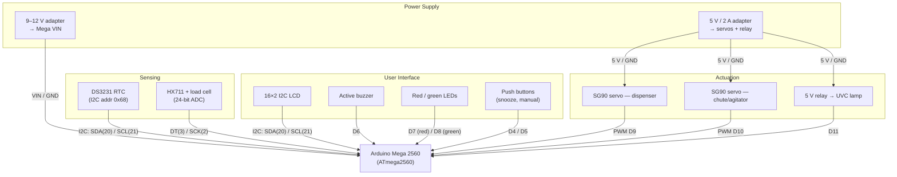

# Hardware Block Diagram

Shows every hardware module of the pill dispenser and the interface that connects it to the Arduino Mega 2560. The I2C bus (SDA/SCL) is shared by the RTC and the LCD; everything else uses dedicated pins.

## Mermaid diagram



## ASCII fallback

```
                     +---------------------------+
  +----------+       |     ARDUINO MEGA 2560      |       +------------------+
  | DS3231   |--I2C--| 20 SDA   21 SCL            |--I2C--| 16x2 I2C LCD     |
  | RTC      |       |                           |       +------------------+
  +----------+       |                           |       +------------------+
  +----------+       |   2 SCK    3 DT            |       | Active buzzer    |
  | HX711 +  |--DT/--|                           |--D6---+------------------+
  | load cell|  SCK  |   4 btn   5 btn            |       +------------------+
  +----------+       |                           |       | LEDs D7/D8       |
  +----------+       |   6 bz    7/8 LED 9/10 PWM |       +------------------+
  | 9-12 V   |--VIN--|  11 relay                  |       +------------------+
  | adapter  |       |                           |--D11--| Relay -> UVC lamp|
  +----------+       +----+----------------+-----+       +------------------+
                          | 5 V / GND (from separate 2 A supply)
                          |                 |
                     +----+-----+     +-----+----+
                     | SG90 D9  |     | SG90 D10 |
                     | dispenser|     | chute    |
                     +----------+     +----------+
```

## Interface summary

| Interface | Pins on Mega | Modules |
|---|---|---|
| I2C | SDA = 20, SCL = 21 | DS3231 (0x68), LCD backpack (0x27) |
| HX711 two-wire | DT = 3, SCK = 2 | Load cell amplifier |
| PWM | 9, 10 | Dispenser servo, chute servo |
| Digital out | 6, 7, 8, 11 | Buzzer, red LED, green LED, relay |
| Digital in | 4, 5 | Snooze button, manual-dispense button |
| Power | VIN, 5 V, GND | 9–12 V adapter; separate 5 V/2 A for servos |
