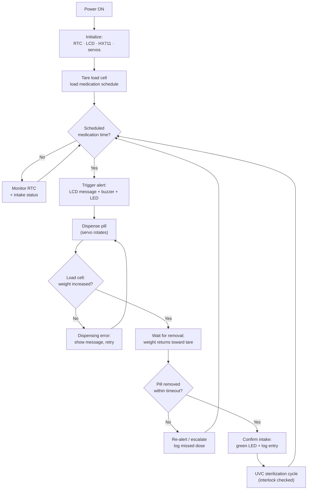

# Flowchart of Operations

The complete operating sequence of the device: power on → monitor RTC → scheduled medication → alert → dispense → detect removal with the load cell → confirm intake → UVC sterilization → return to monitoring.

## Mermaid diagram

## Numbered step list

1. **Power on** — apply power; the Mega boots.
2. **Initialize** — start the RTC, LCD, HX711, and servos; verify the RTC is running.
3. **Tare and load schedule** — zero the load cell with an empty cup; read the medication schedule (time + dose) from memory.
4. **Monitor RTC** — continuously compare the current time against the schedule.
5. **Scheduled time reached** — proceed to the alert step.
6. **Alert** — show the medication on the LCD, sound the buzzer, and light the LED so the user is reminded.
7. **Dispense** — the dispenser servo rotates to release one pill into the cup; the chute servo clears any jam.
8. **Detect dispensed pill** — the load cell reading rises by roughly the pill weight; if no weight change is seen, log a dispensing error and retry.
9. **Wait for removal** — the system watches for the weight to drop back near the tare value (the user picked up the pill).
10. **Confirm intake** — when removal is detected within the timeout, light the green LED and record the intake in the log.
11. **Missed dose** — if the pill is not removed within the timeout, re-alert/escalate and log a missed dose.
12. **UVC sterilization** — after confirmed intake, run the UVC lamp for the set sterilization duration (with the safety interlock satisfied).
13. **Return to monitoring** — go back to step 4 and continue watching the RTC.

## Decision summary

| Decision point | Condition to continue | Failure path |
|---|---|---|
| Scheduled time? | Current time matches a scheduled dose | Keep monitoring |
| Weight increased? | Load cell delta ≥ pill weight − tolerance | Dispensing error → retry |
| Removed within timeout? | Weight returns to tare before timeout | Re-alert, log missed dose |
