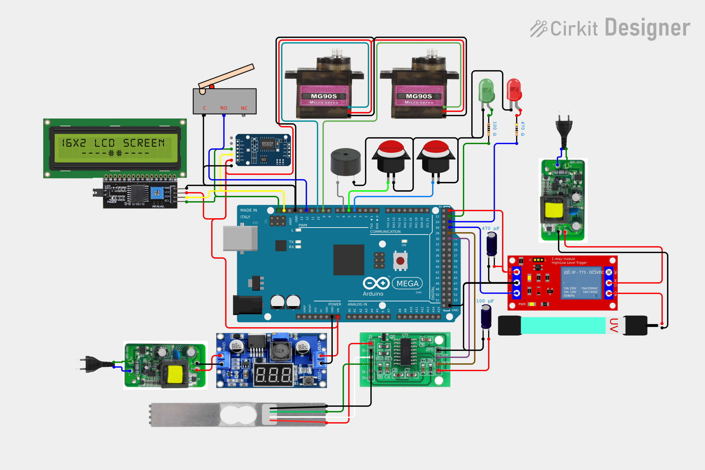

# Wiring Diagrams

Circuit/wiring diagrams for the pill dispenser, drawn in **Cirkit Designer**.

## Official diagram ✅

The wiring diagram is **complete and official**:

**<https://app.cirkitdesigner.com/project/0b7ff26e-cd0e-4625-8aba-37863b629ff8>**

Open the link to view, copy, or edit the project. It matches the pin reference below and the wiring tables in [docs/implementation-guide.md → Step 4](../docs/implementation-guide.md).

## What goes here

- The official project lives in Cirkit Designer (link above).
- `circuit_image.png` — the exported wiring diagram (embedded below and in the root [README.md](../README.md)).
- Optional additional exports: `.cirkit` / exported JSON.

## Diagram

## Keeping the diagram in sync

If any wiring changes, update the official project to match:

1. Open the project (link above).
2. Edit the components/connections to match the pin reference below and [docs/block-diagram.md](../docs/block-diagram.md).
3. Export a clean PNG/SVG (`File → Export`) and save it as `circuit_image.png` (overwrites the image above).

## Component list (matches [docs/bom.md](../docs/bom.md))

Arduino Mega 2560 · DS3231 RTC module · 16×2 LCD with I2C backpack · HX711 + load cell · MG90S metal-gear servo ×2 · active buzzer · LEDs (red/green) + 220 Ω resistors · push buttons ×2 (internal pull-up) · interlock microswitch · 5 V relay module · UVC LED module (265–280 nm, 12 V DC, built-in driver) · 12 V adapter · LM2596S buck converter (12 V → 5 V, 7-seg voltmeter) · breadboard/jumper wires

## Pin reference (from [docs/block-diagram.md](../docs/block-diagram.md))

| Module | Mega 2560 pin | Power |
|---|---|---|
| DS3231 RTC | SDA → 20, SCL → 21 | 5 V, GND |
| 16×2 I2C LCD | SDA → 20, SCL → 21 | 5 V, GND |
| HX711 | DT → 31, SCK → 29 | 5 V, GND |
| Servo — dispenser | signal → 9 | **5 V rail (LM2596S)** (not Mega 5 V) |
| Servo — spoon | signal → 10 | **5 V rail (LM2596S)** |
| Buzzer | + → 6 (100 Ω in series) | GND |
| Red LED | + → 25 via 220 Ω | GND |
| Green LED | + → 23 via 220 Ω | GND |
| Relay (UVC) | IN → 27 | 5 V, GND; UVC LED module on relay contacts: 12 V → COM, NO → module + |
| Snooze button | → 4 (INPUT_PULLUP) | other leg → GND |
| Manual button | → 5 (INPUT_PULLUP) | other leg → GND |
| Interlock switch | → 12 (INPUT_PULLUP) | other leg → GND |
| Power | 12 V → VIN | 12 V → LM2596S in; 5 V out → servo/relay coil rail; GND shared |
| UVC LED module | — | 12 V from main adapter → relay COM → relay NO → module +; module − → GND (switched by D27); no ballast, no mains |

> **Critical rule when drawing:** servos and the relay coil must be powered from the **LM2596S buck converter's 5 V output** (12 V in), sharing GND with the Mega — never from the Mega's 5 V pin. The **UVC LED module (265–280 nm) has a built-in constant-current driver** and runs from **12 V DC** through the relay contacts (12 V → relay COM → relay NO → module +) — the whole device is 12 V/5 V, no mains. Keep the HX711 signal wires away from servo/power traces.

## Power via VIN (decision)

The Mega 2560 is powered through the **VIN pin** (not USB, not the barrel jack):

- Connect the 12 V adapter's `+` to **VIN** and `−` to **GND**. The onboard regulator steps the input down to 5 V for the logic.
- **VIN accepts 7–12 V; do not exceed 12 V.**
- Unplug USB when running on VIN power.
- Servos and the relay coil run from the **LM2596S buck converter** (12 V in → 5 V out) — the Mega's 5 V output cannot supply their inrush current.
- The **UVC LED module (265–280 nm) runs from 12 V DC** through the relay contacts (12 V → relay COM → relay NO → module +; module − → GND) — its built-in constant-current driver needs no ballast and no mains.
- **LM2596S setup:** set the output to exactly **5.0 V** (trimmer + multimeter) before connecting any load; rated 3 A max (add a heatsink for continuous use); the 7-segment display shows the output voltage for verification.
